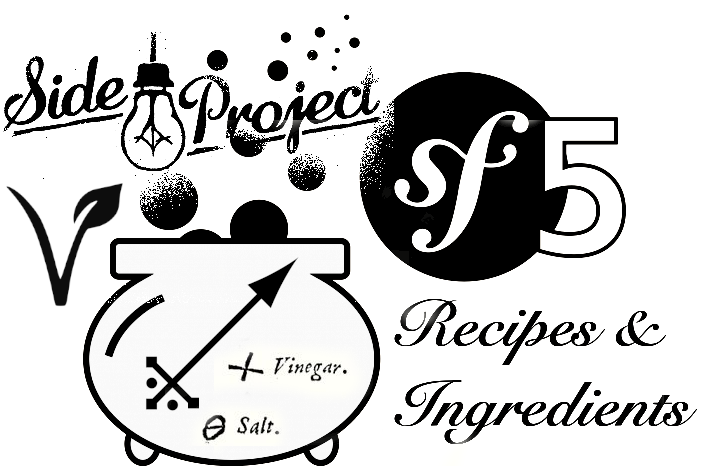

# recipes-ingredients
simple recipe search based on existing ingredients



## Introduction (German)

Diese Rezeptdatenbank mit Rückwärtssuche ist ein kleines Spielprojekt mit der Aufgabe, eine Datenbank von Kochrezepten mit "Rückwärtssuche" zu bieten, wodurch die Suche nach Rezepten mit vorhandenen Zutaten oder aber mit bestimmten enthaltenen Nährstoffen ermöglicht wird. Persönlich möchte ich dadurch mein Wissen im Bereich PHP, Symfony und Vue.js verbessern. Technologisch basiert das Projekt auf dem PHP-Framework Symfony in der aktuellen Version 5. Die vergleichsweise klassische Softwarearchitektur soll mit einer minimalen, leichtgewichtigen und idealerweise optionalen Frontend-Anwendung auskommen (Progressive Enhancement), die native Webstandards wie HTML 5, CSS 3 und Webforms nutzt und auf unnötigen Einsatz von JavaScript und CSS-in-JS verzichtet und auch auf einem klassischen LAMP-Stack eingesetzt werden kann. Wichtig sind Barrierefreihei, Webperformance und Wartbarkeit. Im Frontend könnten Vue.js, Stencil oder Svelte zum Einsatz kommen.

## Introduction (English)

This recipe database with reverse search is a little side project with the goal to provide a database of cooking recipies with a reverse search, that allows to find recipes by existing ingredients or desired nutritients. Personally, I want to improve my knowledge of PHP, Symfony, and Vue.js. Technologically, this project is based on the PHP framework Symfony in the current version 5. The comparatively classic software architecture should go with a minimal, lightweight and ideally optional frontend application (progressive enhancement), using native web standards like HTML 5, CSS 3, and webforms while abstaining from unnecessary JavaScript and CSS-in-JS, so it can be hosted on a classic LAMP stack. Accessibility, web performance and maintainability are important. For the frontend, I might use Vue.js, Stencil or Svelte.

## Install

```
composer install
symfony server:ca:install
``` 

## Run

```
symfony serve --port=9876
open https://localhost:9876
```

## Notes before 2020

using the Symfony framework,
which, without "reinventing the wheel",should still be close to my original  ideas:

- classic backend:
- RDBMS (mySQL or MariaDB)
- (PHP runs on classic shared hosting)
- alternatively use NodeJS, Express
- full page response to GET, POST requests
- JSON response to AJAX REST requests
- simple html based (fallback) frontend client with simple responsive CSS
- utility class names
- frontend accessibility
- progressive enhancement:
- progressive web app with Vue.js or SvelteJS
- caching
- modularity, starting with a static mock / click dummy

Document what was done and why:
based on my personal experience during the past years, with heavyweight  frontend frameworks often ignoring webspeed / performance, accessibility, search engine optimization, and web standards like HTML 5, webforms, and CSS 3, compared to software like Shopware 6, which is based on Symfony 4, and my ongoing distaste of ReactJS and CSS-in-JS.

https://github.com/openmindculture/recipes-ingredients

https://trello.com/b/gTL0dqzJ/reactive-recipes

https://www.open-mind-culture.org/recipes
